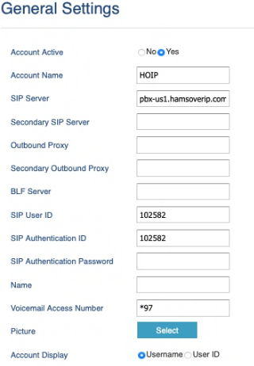

# Grandstream GXP21xx-series

The Grandstream GXP21xx series is a family of high-end IP phones designed for business users who need advanced features and handle high call volumes. While they share core functionalities like HD audio, a Linux-based OS, and Gigabit Ethernet ports with PoE, the main differences lie in the number of lines, display size and resolution, and programmable keys.

These instructions are based on the GXP2160, however the GXP21xx-series uses the same underlying firmware so the web interface should look the same, except for where the featureset differs.

??? info "Here's a table of the differences between some of the key features across the GXP21xx-series"

    | Feature                          | GXP2130 | GXP2135 | GXP2140 | GXP2160 | GXP2170 |
    | -------------------------------- | :-----: | :-----: | :-----: | :-----: | :-----: |
    | Lines / SIP Accounts             | 3 / 3   | 8 / 4   | 4 / 4   | 6 / 6   | 12 / 6  |
    | Display size                     | 2.8"    | 2.8"    | 4.3"    | 4.3"    | 4.3"    |
    | Display resolution               | 320x240 | 320x240 | 480x272 | 480x272 | 480x272 |
    | Programmable BLF/Speed-Dial Keys | 8       | 32      | 0       | 24      | 48      |
    | Conferencing                     | 4-way   | 4-way   | 5-way   | 5-way   | 5-way   |
    | Bluetooth                        | Yes     | Yes     | Yes     | Yes     | Yes     |
    | USB Port                         | No      | No      | Yes     | Yes     | Yes     |

## Configuring the phone for HOIP

1. **Find the phone's IP address:** Access the phone's menu, navigate to Status -> Network Status, and locate the IPv4 address.
2. **Access the web interface:** Open a web browser and enter the phone's IP address.
3. **Log in:** Use the default username (admin) and password (admin) to log in, or your configured credentials.
4. **Navigate to Accounts:** Go to Accounts -> Account 1 (or the desired account) -> General Settings.
5. **Enter SIP details:** Input the necessary SIP credentials provided by your VoIP provider, including Account Active, Account Name, SIP Server, SIP User ID, Authenticate ID, and Authenticate Password.

    

    **These are the details to enter in the General Settings page**

    * **Account Active**: Yes
    * **Account Name**: Can be anything, "HOIP" is a good choice
    * **SIP Server**: This will be the SIP Proxy provided in the email with your credentials
    * **SIP User ID**: This will be the Extension number in the same email
    * **SIP Authentication ID**: This will also be your Extension number
    * S**IP Authentication Password**: This is the password provided in the email

    

    !!! warning "Must be admin"

        You must ensure that you log into the phone as `admin` otherwise you will not see the screen as it appears above.

6. **Configure network settings:** Navigate to Accounts -> Account 1 -> Network Settings and adjust NAT Traversal settings as needed.  Make to to set transport to UDP
7. **Save and apply:** Click "Save" and then "Apply" to save the changes.
8. **Confirm registration:** Go to the Status page on the web GUI and check the SIP registration status to ensure the account is successfully registered.

---

!!! note "Written by Brad N8PC, last updated 2025-08-07"
