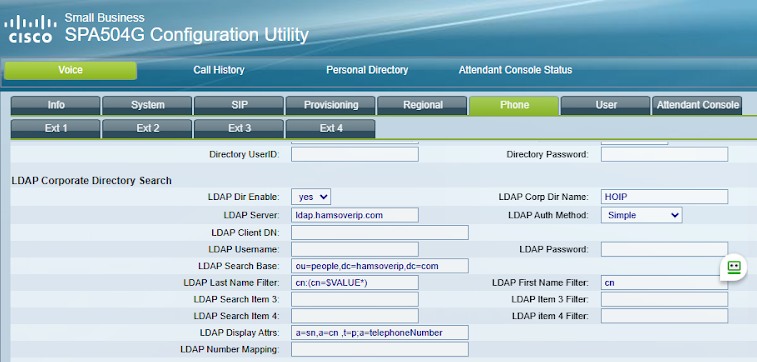
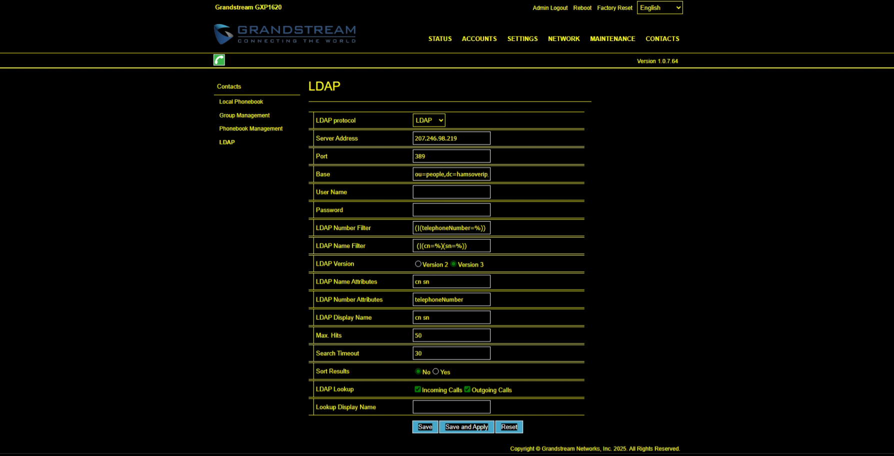

# Lightweight Directory Access Protocol (LDAP)

!!! success "You can now get to this page using a shorter URL: [hamsoverip.github.io/ldap](https://hamsoverip.github.io/ldap)"

Hams Over IP now supports a phone-based directory of HOIP users using LDAP which a large number of phones can support.  Whilst the implementation and usage of this directory differs between devices - sometimes significantly - the information needed to implement it is the same.  We've included phone-specific instructions below, but also the basic information so that you can set this up on a phone we haven't mentioned.

??? info "Basic LDAP details"

    Some of these are specific to certain kinds of devices

    ```
    Server:                 207.246.98.219
    Port:                   389
    TLS Mode:               LDAP or No
    Protocol:               Version 3

    Authentication Mode:    None
    Username:               [leave blank]
    Password:               [leave blank]

    Search Base:            ou=people,dc=hamsoverip,dc=com

    Name Attributes:        cn sn
    Number Attributes:      telephoneNumber
    Display Attributes:     a=sn,a=cn,t=p;a=telephoneNumber

    Last Name Filter:       sn
    First Name Filter:      cn
    Number Filter:          telephoneNumber
    Name Filter:            (|(cn=%)(sn=%))
    Number Filter:          (|(telephoneNumber=%))

    Max Hits:               50
    Lookup Incoming Call:   Disabled
    Lookup Outgoing Call:   Enabled

    ```

## Cisco

??? abstract "Cisco SPA50n/51n"

    **Instructions**

    For the Cisco 50n and 51n phones, the following steps apply for setting up the LDAP on Hams Over IP.

    1. Log in to the dashboard of your phone by using the phone's IP address.
    2. Click on **Admin**, then on **Advanced**.
    3. Once on **Advanced**, click the **Phone** option.
    4. When in the **Phone** option, scroll down to **LDAP Corporate Directory Search**.
    5. Enter the following as shown here:

        - **LDAP Dir Enable** select Yes
        - **LDAP Server** is `ldap.hamsoverip.com`
        - In **LDAP Search Base**, enter the following: `ou=people,dc=hamsoverip,dc=com`
        - In **LDAP Display Atts**, enter: `a=sn,a=cn,t=p;a=telephoneNumber`
        - In **LDAP Last Name Filter**, enter: `cn:(cn=$VALUE*)`
        - Under **LDAP Corp Dir Name**, enter `HOIP`
        - Under **LDAP Auth Method**, pick Simple
        - Under **LDAP First Name Filter** is: `cn`

    6. After entering all the information as shown here, click on [Submit All Changes].
    7. That's it, you are done.

    

    !!! note "Last updated 2025-07-24 Mike KF4BOG"

??? abstract "Cisco SPA525G/G2"

    Settings are located in the web interface (in Admin/Advanced mode), in the Phone tab.

    **Parameters**

    ```text
    LDAP Dir Enable:        yes
    Corp Dir Name:          HOIP (you can choose your own value for this)
    Server:                 ldap.hamsoverip.com:389
    Search Base:            ou=people,dc=hamsoverip,dc=com
    Auth Type:              Simple
    Last Name Filter:       cn:(cn=$VALUE*)
    First Name Filter:      telephoneNumber:(telephoneNumber=*$VALUE*)
    Display Attr:           a=cn;a=telephoneNumber,n=Phone,t=p
    ```

    Leave all other fields blank.

    

    **Implementation**

    1. Go to you front panel of your Cisco Phone
    2. Press settings Button
    3. Go to Menu 10 Status
    4. Go to 2 network Status
    5. Get your IP address from the Phone
    6. Bring up your web browser
    7. Type in your IP address that you just got from the phone
    8. Log in as admin
    9. Click advanced
    10. Go to PHONE tab
    11. Scroll down to LDAP
    12. Set the Information into the proper places as shown in picture
    13. Press [SUBMIT ALL CHANGES]

    **How to search**

    1. Press the settings button
    2. Press 1 for Directories
    3. Press 2 for HOIP
    4. Press 1 for Simple
    5. Last Name will search by Name or parts of names
    6. First name will search by Number or part of Number
    7. Press [Search] button
    8. Read result of your search on the screen

    

    !!! note "Last updated 2025-07-23 Brad N8PC"

## Fanvil

??? abstract "Fanvil X210-V2"

    Settings are located in the web interface, in the Phonebook section, in the Cloud phonebook tab.

    **Parameters**

    ```text
    LDAP:                   [select an LDAP # that isn't in use]
    Display Title:          Hams Over IP
    Version:                Version3
    Server Address:         207.246.98.219
    Server Port:            389
    LDAP TLS Mode:          LDAP
    Calling Line:           [select the line you want the call to go out on when you press Dial]
    Authentication:         None
    Search Base:            ou=people,dc=hamsoverip,dc=com
    Max Hits:               50
    Telephone:              telephoneNumber
    Name Attr:              cn sn
    Sort Attr:              cn
    Display Name:           cn
    Name Filter:            (|(cn=%)(sn=%))
    Number Filter:          (|(telephoneNumber=%))
    Enable Out Call Search: Enabled
    ```

    Leave all other fields blank.

    

    **How to search**

    1. Press the Menu softkey
    2. Use the arrow keys to highlight the Contact icon, and press OK
    3. Use the arrow keys to highlight option 5. LDAP
    4. Use the keypad to enter a search value
        * Pressing a key on the keypad will insert that digit, subsequent presses in quick succession will cycle through the lower case letters associated with that key, then the upper case letters, then back to the digit again.
        * A brief pause after the last press will allow you to enter another character.  If you foul it up, you can press the Delete softkey to remove the last character entered.
        * Results will appear as you enter characters
    5. Once you have the correct results, you can use the arrow keys to select the entry relating to the number you wish to dial.
    6. Press the Dial softkey and the number will be immediately called.

    !!! note "Last updated 2025-07-23 Dave M7TLB"

## Grandstream

??? abstract "Grandstream GXP1620"

    Settings are located in the web interface, in the Contacts tab, in the LDAP section.

    **Parameters**

    ```text
    LDAP Protocol:          LDAP
    Server Address:         207.246.98.219
    Port:                   389
    Base:                   ou=people,dc=hamsoverip,dc=com
    LDAP Number Filter:     ((telephoneNumber=%))
    LDAP Name Filter:       ((cn=%)(sn=%))
    LDAP Version:           Version 3
    LDAP Name Attributes:   cn sn
    LDAP Number Attributes: telephoneNumber
    LDAP Display Name:      cn
    Max Hits:               50
    Search Timeout:         30
    LDAP Lookup:            Outgoing calls only
    ```

    Leave all other fields blank.

    

    !!! note "Last updated 2025-07-23 Peter PE1NUL"

## Yealink

??? abstract "Fanvil (generic)"

    **Parameters**

    ```text
    LDAP LABEL:                     HOIP
    LDAP NAME FILTER:               (|(cn=%)(sn=%))
    LDAP NUMBER FILTER:             (|(telephoneNumber=%))
    LDAP TLS MODE:                  LDAP
    SERVER ADDRESS:                 207.246.98.219
    PORT:                           389
    BASE:                           ou=people,dc=hamsoverip,dc=com
    USER NAME:                      LEAVE BLANK
    PASSWORD:                       LEAVE BLANK
    MAX HITS:                       50 default
    LDAP NAME ATTRIBUTES:           cn sn
    LDAP NUMBER ATTRIBUTES:         telephoneNumber
    LDAP DISPLAY NAME:              %cn
    PROTOCOL:                       VERSION 3
    LDAP LOOKUP FOR INCOMING CALL:  DISABLED
    LDAP LOOKUP FOR CALLOUT:        ENABLED
    LDAP SORTING RESULTS:           DISABLED
    ```

    **How to configure LDAP directory on Yaelink phone**
    
    1. Log into phone with IP ADDRESS and click on DIRECTORY TAB.
    2. Click on LDAP on left siide then select ENABLED from DROP DOWN of ENABLE LDAP.
    3. Fill in and select parameters from above list where appropriate.
    4. Click on CONFIRM.
    5. Select DIRECTORY and choose HOIP and press ENTER.
    6. Type in partial callsign or name.

    !!! note "Last updated 2025-07-23 Jesse WH6AV"

---

This is by no means an exhaustive list... you can help us by [contributing](../../wiki/contributing.md) a Guide where one doesn't already exist.
